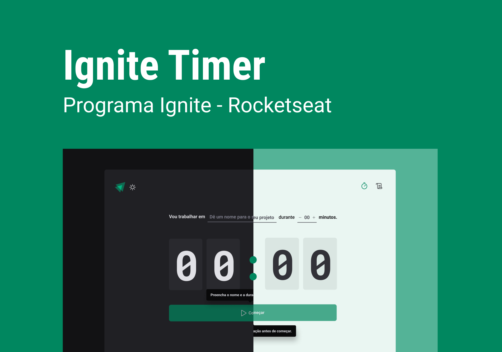

<base target="_blank">
<p align="center">
    
</p>

<h1 align="center">
  Ignite Timer
</h1>

<p align="center">Aplicação React com ViteJS e TypeScript</p>

<p align="center">
  <a href="#">
    
  </a>

  <a href="https://github.com/IgorThierry">
    
  </a>

  <a href="https://www.linkedin.com/in/igorthierry/">
    
  </a>
</p>

## 🚀 Projeto

O Ignite Timer é uma aplicação de controle de tarefas através da Técnica Pomodoro.

A técnica se baseia na ideia de que dividindo o nosso fluxo de trabalho em blocos de concentração intensa, conseguimos melhorar a agilidade do cérebro e estimular nosso foco.

O método consiste em separar as tarefas em pequenos intervalos de tempo, de 25 minutos, que podem ser chamados de “Pomodoros”.

Depois de cada 25 minutos separados, é preciso tirar um momento para relaxar e respirar um pouco, antes de retomar as atividades.

## 🔧 Tecnologias

- [React](https://github.com/facebook/react)
- [TypeScript](https://github.com/microsoft/TypeScript)
- [Vite](https://github.com/vitejs/vite)
- [Phosphor Icons](https://github.com/phosphor-icons/phosphor-home)
- [Styled Components](https://github.com/styled-components/styled-components)
- [React Hook Form](https://github.com/react-hook-form/react-hook-form)
- [Zod](https://github.com/colinhacks/zod)
- [Immer](https://github.com/immerjs/immer)

## 💻 Executando a aplicação

Após clonar o repositório, acesse a pasta do projeto;

```
$ cd projeto
```

Em seguida, instale as dependências;

```
$ npm i
```

Inicie o projeto;

```
$ npm run dev
```

## 🚀 **Em constante evolução...**

---

Feito com ♥ by [Igor Thierry](https://www.linkedin.com/in/igorthierry/)
